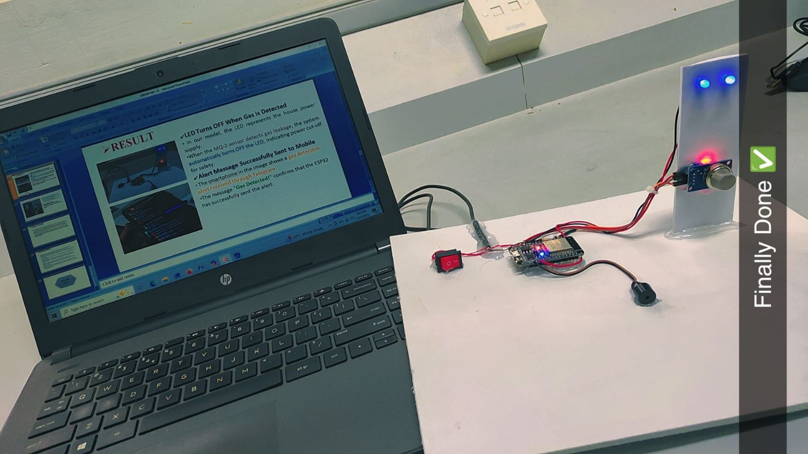
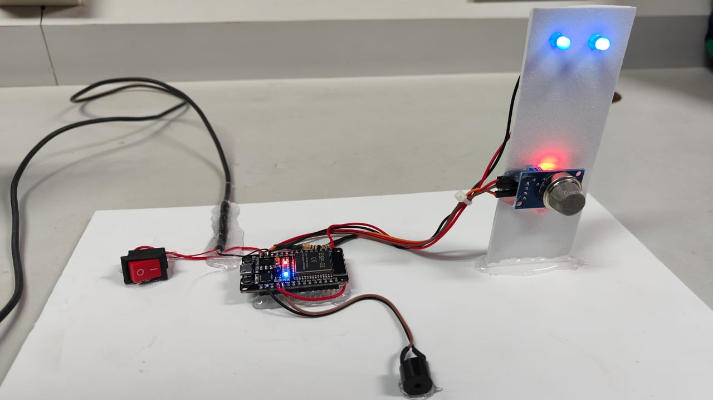
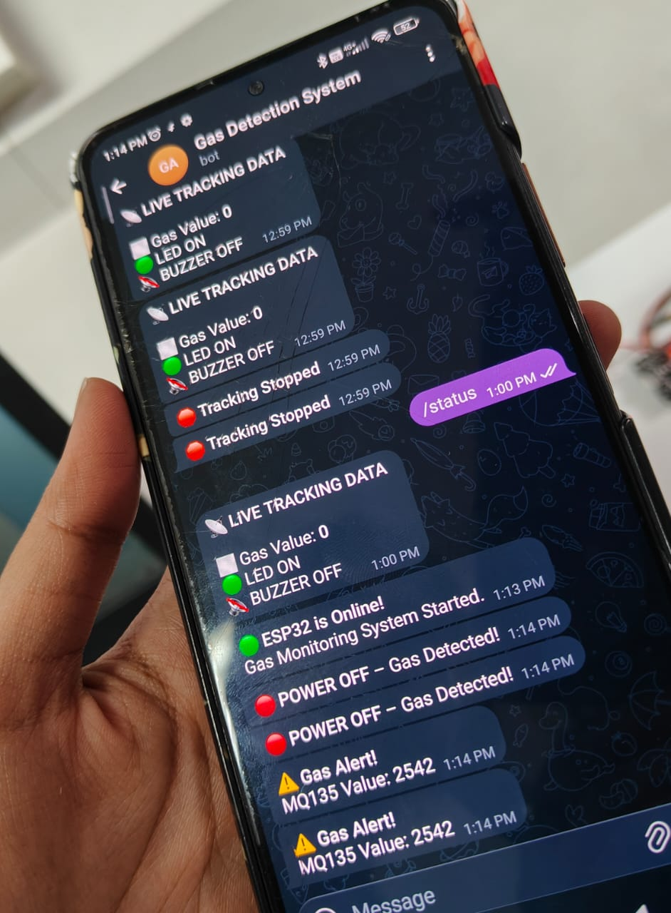

# Smart Gas Leakage Detection IoT

An IoT-based smart gas leakage detection system using ESP32, MQ-135 gas sensor, LED, buzzer, and Telegram alerts for real-time monitoring and safety.

## 📌 Project Overview

This mini project is designed to detect gas leakage in real time and provide immediate alerts. The system uses an MQ-135 gas sensor connected to an ESP32. When the gas level exceeds the predefined threshold, the system activates the buzzer and LED alert and sends a notification to a mobile device through Telegram.

The system also supports Telegram commands for checking the current gas status and starting or stopping live tracking.

## ✨ Key Features

- Real-time gas leakage detection
- ESP32-based IoT system
- MQ-135 gas sensor
- LED and buzzer alert system
- Telegram mobile notifications
- Live gas status monitoring
- Telegram commands for tracking
- Remote monitoring through the internet

## 🛠️ Hardware Components

- ESP32 Development Board
- MQ-135 Gas Sensor
- LED
- Buzzer
- Connecting Wires
- USB Cable

## 💻 Software and Technologies

- Arduino IDE
- Embedded C / C++
- ESP32
- Wi-Fi
- Telegram Bot API
- IoT

## ⚙️ Working Principle

1. The MQ-135 sensor continuously monitors the gas level.
2. The ESP32 reads the sensor value.
3. If the gas value exceeds the predefined threshold, the buzzer is activated and the LED status changes.
4. A gas leakage alert is sent to the configured Telegram account.
5. When the gas level returns to normal, a notification is sent.
6. Users can use Telegram commands such as `/status`, `/track`, and `/stop` for monitoring.

## 📸 Project Demonstration

### Complete Project Setup

### Hardware Setup

### Gas Detection Alert

### Telegram Monitoring

## 📂 Project Files

- `Smart_Gas_leakage_Detection.ino` – ESP32 source code
- `complete_project_setup.jpeg` – Complete project setup
- `hardware_setup.jpeg` – Hardware setup
- `gas_detection_alert.jpeg` – Gas detection alert demonstration
- `telegram_monitoring.jpeg` – Telegram monitoring demonstration

## 🎯 Applications

- Kitchen gas leakage monitoring
- Industrial safety systems
- Smart home safety
- Remote gas monitoring
- IoT-based safety applications

## 🚀 Future Enhancements

- Add an automatic gas valve shut-off mechanism
- Add cloud-based data logging
- Develop a dedicated mobile application
- Add additional gas sensors
- Improve sensor calibration and accuracy

## 👩‍💻 Author

**Ramya Shankar**

Electronics and Communication Engineering Student

---

⭐ This project was developed as a mini project to gain practical experience in IoT, ESP32, sensors, embedded systems, wireless communication, and real-time alert systems.
